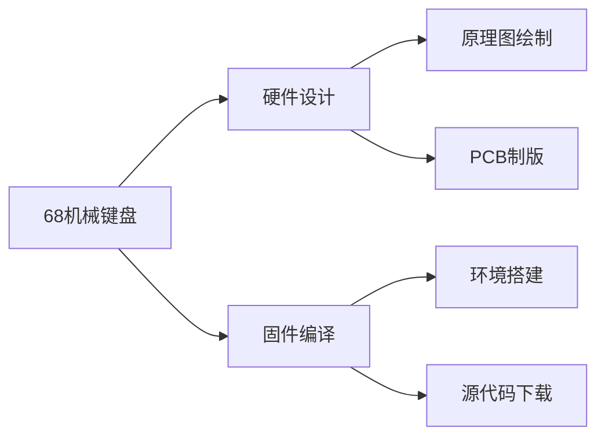

# 68键键盘教程

###  设计框图





### 固件的编译


* **环境搭建**

1.  **下载安装msys2客户端**

   去msys2官网下载该客户端，或者去清华大学的源下载该软件。下载完成之后，打开安装路径

   ```
   ...\msys64\etc\pacman.d
   ```

   修改配置文件：

   ```
   修改mirrorlist.msys，添加
   Server =  https://mirrors.tuna.tsinghua.edu.cn/msys2/msys/$arch；
   
   修改mirrorlist.mingw32，添加
   Server =  https://mirrors.tuna.tsinghua.edu.cn/msys2/mingw/i686。
   
   修改mirrorlist.mingw64，添加
   Server =  https://mirrors.tuna.tsinghua.edu.cn/msys2/mingw/x86_64。
   ```

   直接运行mingw64.exe即可。

* **编译**

2. **软件配置**

   ```
   输入 pacman -Syu 命令，更新数据库
   ```

   期间会有个安装确认，无脑Yes就行了。

   安装完成之后，需要重启MSYS2即可。

   ```
   使用 pacman -S git 命令，安装git。
   ```

   到这里基本的环境便配置好了。

3. **简单编译**

   去码云Gitee下载能快点，下载解压至你需要的地方。

   下载完成之后，(我的文件在D:\KEYBOARD\下放着)

   ```
   cd /D/keyboard/qmk
   ```

   接着使用命令

   ```
   util/msys2_install.sh  安装编译QMK固件的驱动程序。
   ```

   基本2个小时即可安装完毕。

   将自己的文件夹里的

   ```
   wen68 
   ```

   文件夹放入至

   ```
   qmk\keyboards 文件夹下
   ```

   使用

   ```
   make wen68:default  或者
   make wen68:via      或者，
   qmk compile -kb wen68 -km default 或者
   qmk compile -kb wen68 -km via
   
   其中default和via 是不同的文件夹，里面存放着不同的keymap.c文件，使用qmk compile编译命令能快些
   ```

   编译成功之后的文件存放在

   ```
   .build/wen68_via.hex  hex便是自己编译的固件。
   ```

### 固件的烧写

打开文件夹内

```
keyboard\tools\qmk_toolbox.exe
```

打开，连接键盘，按下键盘后的复位按钮，上传即可。